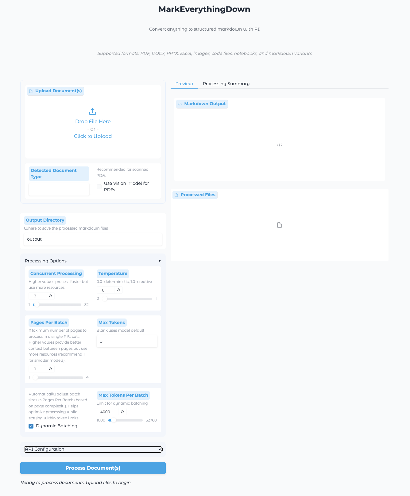
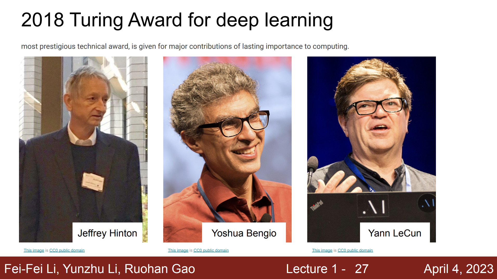
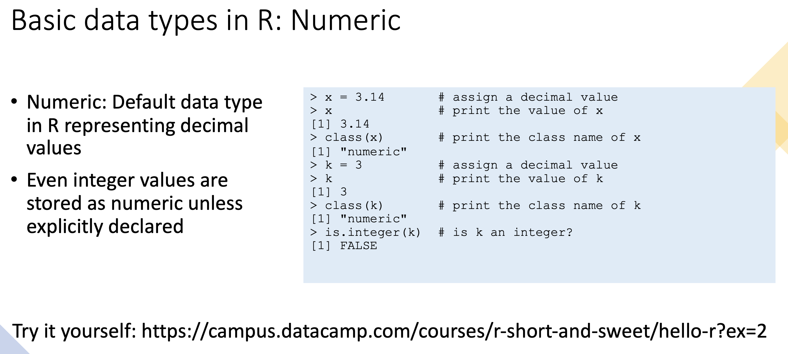
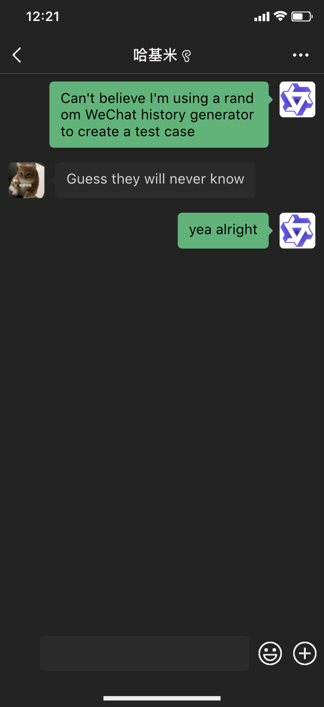

# MarkEverythingDown

+ **MarkEverythingDown** - 你的全能文档Markdown转换神器！🚀
  一键将PDF/Office/图片/代码等文件转换为结构清晰的Markdown，专为LLM优化设计。结合Qwen2.5 VL视觉模型，连扫描件都能智能解析！

**MarkEverythingDown** is a versatile document conversion tool that transforms various file formats into clean, structured markdown. Whether you're working with PDFs, Office documents, images, code files, or notebooks, MarkEverythingDown provides a unified interface to convert them all.

The tool is specifically designed to leverage **Qwen2.5 VL** (Vision-Language) models through OpenAI-compatible APIs, supporting both local inference engines like LMStudio and cloud API providers like DashScope. This design enables high-quality processing of visual content while maintaining flexibility in deployment options.

I developed this tool to streamline the conversion of documents into markdown format, which is both LLM-friendly and easy for human to read. The goal is to make document processing as seamless as possible, allowing users, who may not be familiar with programming, to easily convert their files for building their own RAG applications or fine-tuning their own models.

## Features

- **Multi-format support**: Convert PDFs, DOCX, PPTX, images, code files, notebooks, and markdown variants
- **Intelligent processing**: Automatically selects the appropriate processor for each file type
- **Vision AI support**: Optimized for Qwen2.5 VL models with OpenAI-compatible interface
- **Dual processing options**: Use local inference APIs or cloud APIs
- **Batch processing**: Process multiple files at once with a simple interface
- **User-friendly UI**: Easy-to-use web interface with Gradio
- **Command line interface**: Quick conversions from the terminal

## Supported Formats

| Category | Formats |
|----------|---------|
| Documents | PDF, DOCX, PPTX |
| Images | PNG, JPG, JPEG, BMP |
| Code | Python, R, and other programming languages |
| Notebooks | Jupyter Notebooks (ipynb) |
| Markdown | MD, RMD (R Markdown) |
| Text | TXT |

## Installation

```bash
# Clone the repository
git clone https://github.com/yourusername/MarkEverythingDown.git
cd MarkEverythingDown

# Set up a virtual environment
python -m venv venv
source venv/bin/activate  # On Windows: venv\Scripts\activate

# Install dependencies
pip install -r requirements.txt
```

## Usage

### Web UI (Recommended)

```bash
# Launch the web interface
python main.py --ui
```



This will open a browser window with the MarkEverythingDown interface, where you can:
1. Upload single or multiple files
2. Select an output directory
3. Configure processing options
4. Process documents and preview results

### Command Line

```bash
# Process a single file
python main.py path/to/document.pdf --output output_dir

# Process a directory
python main.py path/to/documents/ --output output_dir

# Process a PDF with vision model
python main.py path/to/document.pdf --output output_dir --api-key your_api_key --force-vision
```

## Vision Processing Configuration

**MarkEverythingDown** is specifically optimized for Qwen2.5 VL models and supports two inference methods:

### Local Processing

If you can run the model locally:

```bash
python main.py path/to/image.png \
    --api-key lmstudio \
    --base-url http://localhost:1234/v1 \
    --model qwen2.5-vl-7b-instruct
```

### Cloud Processing

Access more powerful models through cloud APIs, such as DashScope:

```bash
python main.py path/to/image.png \
    --api-key your_dashscope_api_key \
    --base-url https://dashscope.aliyuncs.com/compatible-mode/v1 \
    --model qwen2.5-vl-72b-instruct
```

## Example Use Cases

Below are the user case of converting images, PDFs, and Office documents into markdown format. You are welcome to try it out with your own documents, either through the web UI or the command line. 

### 1. Image Processing

#### Your Average Slides from a Course 

**Input**: 

**Command**:
```bash
python test_processor.py test_docs/test_image1.png \
    --api-key lm_studio \
    --base-url http://localhost:1234/v1 \
    --model qwen2.5-vl-7b-instruct
```

**Output** (`test_output/test_image1.md`):
```markdown
# 2018 Turing Award for deep learning

The most prestigious technical award, given to individuals who have made major 
contributions of lasting importance to computing.

## Recipients

- **Geoffrey Hinton**
- **Yoshua Bengio**
- **Yann LeCun**

## Lecture Details
- **Lecture 1 - Slide 27**
- **Date:** April 4, 2023
- **Presenters:** Fei-Fei Li, Yunzhu Li, Ruohan Gao
```

#### Your Average Slides from a Course (a bit more complex)

**Input**: 

**Command**:
```bash
python test_processor.py test_docs/test_image3.png \
    --api-key lm_studio \
    --base-url http://localhost:1234/v1 \
    --model qwen2.5-vl-7b-instruct
```

**Output** (`test_output/test_image3.md`):
```markdown
# Basic Data Types in R: Numeric

## Numeric: Default Data Type in R Representing Decimal Values

- **Numeric:** The default data type in R for representing decimal values.
  - Assign a decimal value:
    ```R
    x <- 3.14
    ```
  - Print the value of `x`:
    ```R
    x
    # [1] 3.14
    ```
  - Print the class name of `x`:
    ```R
    class(x)
    # [1] "numeric"
    ```
  - Assign an integer value:
    ```R
    k <- 3
    ```
  - Print the value of `k`:
    ```R
    k
    # [1] 3
    ```
  - Print the class name of `k`:
    ```R
    class(k)
    # [1] "numeric"
    ```
- Even integer values are stored as numeric unless explicitly declared:
    ```R
    class(k)
    # [1] "numeric"
    ```
  - Check if `k` is an integer:
    ```R
    is.integer(k)
    # [1] FALSE
    ```

## Try it Yourself:
- [Link to Practice](https://campus.datacamp.com/courses/r-short-and-sweet/hello-r?ex=2)
```

#### Even a WeChat Screenshot

**Input**: 

**Command**:
```bash
python test_processor.py test_docs/test_image2.png \
    --api-key lm_studio \
    --base-url http://localhost:1234/v1 \
    --model qwen2.5-vl-7b-instruct
```

**Output** (`test_output/test_image2.md`):
```markdown
# WeChat Transcript

**Sender:** User 1  
> Can't believe I'm using a random WeChat history generator to create a test case

**Sender:** User 2  
> Guess they will never know

**Sender:** User 1  
> yea alright
```


### 2. PDF Processing (Two Methods)

#### Text Extraction (Default)

**Input**: [sample_pdf.pdf](test_docs/sample_pdf.pdf)

**Command**:
```bash
python test_processor.py test_docs/sample.pdf
```

**Output** (`test_output/sample_pdf_noVision.md`):

As you can tell, PDF is a really tricky format to process. The output is not very clean, and the formatting is not preserved.

```markdown
## Page 1

March 5, 2025
Qwen2.5-VL Technical Report
Qwen Team, Alibaba Group
https://chat.qwenlm.aihttps://huggingface.co/Qwen
https://modelscope.cn/organization/qwenhttps://github.com/QwenLM/Qwen2.5-VL
Abstract
We introduce Qwen2.5-VL, the latest flagship model of Qwen vision-language series,
which demonstrates significant advancements in both foundational capabilities and
innovative functionalities. Qwen2.5-VL achieves a major leap forward in understanding
and interacting with the world through enhanced visual recognition, precise object local-
ization, robust document parsing, and long-video comprehension. A standout feature of
Qwen2.5-VL is its ability to localize objects using bounding boxes or points accurately. It
provides robust structured data extraction from invoices, forms, and tables, as well as
detailed analysis of charts, diagrams, and layouts. To handle complex inputs, Qwen2.5-
VL introduces dynamic resolution processing and absolute time encoding, enabling it
to process images of varying sizes and videos of extended durations (up to hours) with
second-level event localization. This allows the model to natively perceive spatial scales
and temporal dynamics without relying on traditional normalization techniques. By
training a native dynamic-resolution Vision Transformer (ViT) from scratch and incorpo-
rating Window Attention, we have significantly reduced computational overhead while
maintaining native resolution. As a result, Qwen2.5-VL excels not only in static image
and document understanding but also as an interactive visual agent capable of reasoning,
tool usage, and task execution in real-world scenarios such as operating computers and
mobile devices. The model achieves strong generalization across domains without requir-
ing task-specific fine-tuning. Qwen2.5-VL is available in three sizes, addressing diverse
use cases from edge AI to high-performance computing. The flagship Qwen2.5-VL-72B
model matches state-of-the-art models like GPT-4o and Claude 3.5 Sonnet, particularly
excelling in document and diagram understanding. The smaller Qwen2.5-VL-7B and
Qwen2.5-VL-3B models outperform comparable competitors, offering strong capabilities
even in resource-constrained environments. Additionally, Qwen2.5-VL maintains robust
linguistic performance, preserving the core language competencies of the Qwen2.5 LLM.
1arXiv:2502.13923v1  [cs.CV]  19 Feb 2025

## Page 2

1Introduction
Large vision-language models ( LVLMs ) ( OpenAI ,2024;Anthropic ,2024a ;Team et al. ,2023;Wang et al. ,
2024f ) represent a pivotal breakthrough in artificial intelligence, signaling a transformative approach to
multimodal understanding and interaction. By seamlessly integrating visual perception with natural
language processing, these advanced models are fundamentally reshaping how machines interpret and
analyze complex information across diverse domains. Despite significant advancements in multimodal
large language models, the current capabilities of these models can be likened to the middle layer of a
sandwich cookie—competent across various tasks but falling short of exceptional performance. Fine-
grained visual tasks form the foundational layer of this analogy. In this iteration of Qwen2.5-VL, we
are committed to exploring fine-grained perception capabilities, aiming to establish a robust foundation
for LVLMs and create an agentic amplifier for real-world applications. The top layer of this framework
is multi-modal reasoning, which is enhanced by leveraging the latest Qwen2.5 LLM and employing
multi-modal QA data construction.
A spectrum of works have promoted the development of multimodal large models, characterized by
architectural design, visual input processing, and data curation. One of the primary drivers of progress
in LVLMs is the continuous innovation in architecture. The studies presented in ( Alayrac et al. ,2022;
Li et al. ,2022a ;2023b ;Liu et al. ,2023b ;a;Wang et al. ,2024i ;Zhang et al. ,2024b ;Wang et al. ,2023) have
incrementally shaped the current paradigm, which typically consists of a visual encoder, a cross-modal
projector, and LLM. Fine-grained perception models have emerged as another crucial area. Models like
(Xiao et al. ,2023;Liu et al. ,2023c ;Ren et al. ,2024;Zhang et al. ,2024a ;d;Peng et al. ,2023;Deitke et al. ,
2024) have pushed the boundaries of what is possible in terms of detailed visual understanding. The
architectures of Omni ( Li et al. ,2024g ;2025b ;Ye et al. ,2024) and MoE ( Riquelme et al. ,2021;Lee et al. ,
2024;Li et al. ,2024h ;c;Wu et al. ,2024b ) also inspire the future evolution of LVLMs. Enhancements in
visual encoders ( Chen et al. ,2023;Liu et al. ,2024b ;Liang et al. ,2025) and resolution scaling ( Li et al. ,
2023c ;Ye et al. ,2023;Li et al. ,2023a ) have played a pivotal role in improving the quality of practical
visual understanding. Curating data with more diverse scenarios and higher-quality is an essential step
in training advanced LVLMs. The efforts proposed in ( Guo et al. ,2024;Chen et al. ,2024d ;Liu et al. ,2024a ;
Chen et al. ,2024a ;Tong et al. ,2024;Li et al. ,2024a ) are highly valuable contributions to this endeavor.
However, despite their remarkable progress, vision-language models currently face developmental
bottlenecks, including computational complexity, limited contextual understanding, poor fine-grained
visual perception, and inconsistent performance across varied sequence length.
In this report, we introduce the latest work Qwen2.5-VL, which continues the open-source philosophy of
the Qwen series, achieving and even surpassing top-tier closed-source models on various benchmarks.
Technically, our contributions are four-folds: (1) We implement window attention in the visual encoder to
optimize inference efficiency; (2) We introduce dynamic FPS sampling, extending dynamic resolution to
the temporal dimension and enabling comprehensive video understanding across varied sampling rates;
(3) We upgrade MRoPE in the temporal domain by aligning to absolute time, thereby facilitating more
sophisticated temporal sequence learning; (4) We make significant efforts in curating high-quality data
for both pre-training and supervised fine-tuning, further scaling the pre-training corpus from 1.2 trillion
tokens to 4.1 trillion tokens.
The sparkling characteristics of Qwen2.5-VL are as follows:
•Powerful document parsing capabilities: Qwen2.5-VL upgrades text recognition to omni-
document parsing, excelling in processing multi-scene, multilingual, and various built-in (hand-
writing, tables, charts, chemical formulas, and music sheets) documents.
•Precise object grounding across formats: Qwen2.5-VL unlocks improved accuracy in detecting,
pointing, and counting objects, accommodating absolute coordinate and JSON formats for
advanced spatial reasoning.
•Ultra-long video understanding and fine-grained video grounding: Our model extends native
dynamic resolution to the temporal dimension, enhancing the ability to understand videos lasting
hours while extracting event segments in seconds.
•Enhanced agent Functionality for computer and mobile devices: Leverage advanced grounding,
reasoning, and decision-making abilities, boosting the model with superior agent functionality
on smartphones and computers.
2
```

#### Vision Processing (For Scanned Documents)

**Command**:
```bash
python test_processor.py test_docs/sample.pdf \
    --api-key lmstudio \
    --base-url http://localhost:1234/v1 \
    --model qwen2.5-vl-7b-instruct \
    --force-vision
```

**Output** (`test_output/sample_pdf_vision.md`):

With the superb document parsing capability of Qwen2.5 VL, the output is much cleaner, and original structure is preserved.

```markdown
## Page 1

# Qwen2.5-VL Technical Report

**Qwen Team, Alibaba Group**

- 🌐 https://chat.qwenlm.ai
- 😄 https://huggingface.co/Qwen
- 🔗 https://modelscope.cn/organization/qwen
- 📚 https://github.com/QwenLM/Qwen2.5-VL

## Abstract

We introduce Qwen2.5-VL, the latest flagship model of Qwen vision-language series, which demonstrates significant advancements in both foundational capabilities and innovative functionalities. Qwen2.5-VL achieves a major leap forward in understanding and interacting with the world through enhanced visual recognition, precise object localization, robust document parsing, and long-video comprehension. A standout feature of Qwen2.5-VL is its ability to localize objects using bounding boxes or points accurately. It provides robust structured data extraction from invoices, forms, and tables, as well as detailed analysis of charts, diagrams, and layouts. To handle complex inputs, Qwen2.5-VL introduces dynamic resolution processing and absolute time encoding, enabling it to process images of varying sizes and videos of extended durations (up to hours) with second-level event localization. This allows the model to natively perceive spatial scales and temporal dynamics without relying on traditional normalization techniques. By training a native dynamic-resolution Vision Transformer (ViT) from scratch and incorporating Window Attention, we have significantly reduced computational overhead while maintaining native resolution. As a result, Qwen2.5-VL excels not only in static image and document understanding but also as an interactive visual agent capable of reasoning, tool usage, and task execution in real-world scenarios such as operating computers and mobile devices. The model achieves strong generalization across domains without requiring task-specific fine-tuning. Qwen2.5-VL is available in three sizes, addressing diverse use cases from edge AI to high-performance computing. The flagship Qwen2.5-VL-72B model matches state-of-the-art models like GPT-4o and Claude 3.5 Sonnet, particularly excelling in document and diagram understanding. The smaller Qwen2.5-VL-7B and Qwen2.5-VL-3B models outperform comparable competitors, offering strong capabilities even in resource-constrained environments. Additionally, Qwen2.5-VL maintains robust linguistic performance, preserving the core language competencies of the Qwen2.5 LLM.


| Model                | Score |
|----------------------|-------|
| Qwen2.5-VL-728       | 93.2  |
| Claude-3.5-Sonnet-0620 | 95.1  |
| Qwen2.5-VL-72B       | 95.3  |
| GPT-4o-0513          | 95.8  |


## Page 2

# 1 Introduction

Large vision-language models (LVLMs) ([OpenAI, 2024](https://openai.com/blog/); [Anthropic, 2024a](https://www.anthropic.com/index); [Team et al., 2023](https://example.com/team2023); [Wang et al., 2024f](https://example.com/wang2024f)) represent a pivotal breakthrough in artificial intelligence, signaling a transformative approach to multimodal understanding and interaction. By seamlessly integrating visual perception with natural language processing, these advanced models are fundamentally reshaping how machines interpret and analyze complex information across diverse domains. Despite significant advancements in multimodal large language models, the current capabilities of these models can be likened to the middle layer of a sandwich cookie—competent across various tasks but falling short of exceptional performance. Fine-grained visual tasks form the foundational layer of this analogy. In this iteration of Qwen2.5-VL, we are committed to exploring fine-grained perception capabilities, aiming to establish a robust foundation for LVLMs and create an agentic amplifier for real-world applications. The top layer of this framework is multi-modal reasoning, which is enhanced by leveraging the latest Qwen2.5 LLM and employing multi-modal QA data construction.

A spectrum of works has promoted the development of multimodal large models, characterized by architectural design, visual input processing, and data curation. One of the primary drivers of progress in LVLMs is the continuous innovation in architecture. The studies presented in ([Alayrac et al., 2022](https://example.com/alayrac2022); [Li et al., 2022a; 2023b](https://example.com/li2022a); [Liu et al., 2023a; b](https://example.com/liu2023a); [Wang et al., 2024](https://example.com/wang2024); [Zhang et al., 2024b](https://example.com/zhang2024b); [Wang et al., 2023](https://example.com/wang2023)) have incrementally shaped the current paradigm, which typically consists of a visual encoder, a cross-modal projector, and LLM. Fine-grained perception models have emerged as another crucial area. Models like ([Xiao et al., 2023](https://example.com/xiao2023); [Liu et al., 2023c](https://example.com/liu2023c); [Ren et al., 2024](https://example.com/ren2024); [Zhang et al., 2024a; d](https://example.com/zhang2024a); [Peng et al., 2023](https://example.com/peng2023); [Deitke et al., 2024](https://example.com/deitke2024)) have pushed the boundaries of what is possible in terms of detailed visual understanding. The architectures of Omni ([Li et al., 2024g; 2025b](https://example.com/li2024g); [Ye et al., 2024](https://example.com/ye2024)) and MoE ([Riquelme et al., 2021](https://example.com/riquelme2021); [Lee et al., 2024](https://example.com/lee2024); [Li et al., 2024h; c](https://example.com/li2024h); [Wu et al., 2024b](https://example.com/wu2024b)) also inspire the future evolution of LVLMs. Enhancements in visual encoders ([Chen et al., 2023](https://example.com/chen2023); [Liu et al., 2024b](https://example.com/liu2024b); [Liang et al., 2025](https://example.com/liang2025)) and resolution scaling ([Li et al., 2023c](https://example.com/li2023c); [Ye et al., 2023](https://example.com/ye2023); [Li et al., 2023a](https://example.com/li2023a)) have played a pivotal role in improving the quality of practical visual understanding. Curating data with more diverse scenarios and higher-quality is an essential step in training advanced LVLMs. The efforts proposed in ([Guo et al., 2024](https://example.com/guo2024); [Chen et al., 2024d](https://example.com/chen2024d); [Liu et al., 2024a](https://example.com/liu2024a); [Chen et al., 2024a](https://example.com/chen2024a); [Tong et al., 2024](https://example.com/tong2024); [Li et al., 2024a](https://example.com/li2024a)) are highly valuable contributions to this endeavor.

However, despite their remarkable progress, vision-language models currently face developmental bottlenecks, including computational complexity, limited contextual understanding, poor fine-grained visual perception, and inconsistent performance across varied sequence length.

In this report, we introduce the latest work Qwen2.5-VL, which continues the open-source philosophy of the Qwen series, achieving and even surpassing top-tier closed-source models on various benchmarks. Technically, our contributions are four-folds: 
1. We implement window attention in the visual encoder to optimize inference efficiency;
2. We introduce dynamic FPS sampling, extending dynamic resolution to the temporal dimension and enabling comprehensive video understanding across varied sampling rates;
3. We upgrade MRoPE in the temporal domain by aligning to absolute time, thereby facilitating more sophisticated temporal sequence learning;
4. We make significant efforts in curating high-quality data for both pre-training and supervised fine-tuning, further scaling the pre-training corpus from 1.2 trillion tokens to 4.1 trillion tokens.

The sparkling characteristics of Qwen2.5-VL are as follows:

- **Powerful document parsing capabilities:** Qwen2.5-VL upgrades text recognition to omni-document parsing, excelling in processing multi-scene, multilingual, and various built-in (handwriting, tables, charts, chemical formulas, and music sheets) documents.
- **Precise object grounding across formats:** Qwen2.5-VL unlocks improved accuracy in detecting, pointing, and counting objects, accommodating absolute coordinate and JSON formats for advanced spatial reasoning.
- **Ultra-long video understanding and fine-grained video grounding:** Our model extends native dynamic resolution to the temporal dimension, enhancing the ability to understand videos lasting hours while extracting event segments in seconds.
- **Enhanced agent Functionality for computer and mobile devices:** Leverage advanced grounding, reasoning, and decision-making abilities, boosting the model with superior agent functionality on smartphones and computers.
```

### 3. Office Document Processing

Office document are structured in nature, no vision processing is needed.

#### Word Documents (DOCX)

**Input**: [sample_docx.docx](test_docs/sample_docx.docx)

**Command**:
```bash
python test_processor.py test_docs/sample.docx
```

**Output** (`test_output/sample_docx.md`):
```markdown
# This is a Level 1 Heading

## This is a Level 2 Heading

### This is a Level 3 Heading

This is the normal text
```

#### PowerPoint Presentations (PPTX)

**Input**: [sample_pptx.pptx](test_docs/sample_pptx.pptx)

**Command**:
```bash
python test_processor.py test_docs/sample.pptx
```

**Output** (`test_output/sample_pptx.md`):
```markdown
# sample

## Slide 1

### This is a Sample Slide Deck

Hail the Almighty MarkEverythingDown
---
```


## Project Structure

```
MarkEverythingDown/
├── main.py               # Entry point
├── ui/
│   └── app.py            # Gradio UI implementation
├── processors/
│   ├── base.py           # Base processor classes
│   ├── text/             # Text-based processors
│   └── vision/           # Image/PDF vision processors
├── test_docs/            # Example documents
│   ├── sample.pdf
│   ├── sample.docx
│   └── ...
├── test_output/          # Example processed results
│   ├── sample_pdf_vision.md
│   ├── sample_docx.md
│   └── ...
└── requirements.txt      # Dependencies
```


## License

MIT License

## Contributing

Contributions are welcome! Please feel free to submit a Pull Request or open an Issue.

## Acknowledgements

I was inspired to create this project when randomly browsing Andrej Karpathy's X and I saw this tweet:

```text
It's 2025 and most content is still written for humans instead of LLMs. 99.9% of attention is about to be LLM attention, not human attention.

E.g. 99% of libraries still have docs that basically render to some pretty .html static pages assuming a human will click through them. In 2025 the docs should be a single your_project.md text file that is intended to go into the context window of an LLM.

Repeat for everything.
```

So I thought, why not create a tool that can convert any document into a LLM-friendly format? And here we are!

In addition, this project won't be possible without the amazing work of the Qwen team and the open-source community. Special thanks to the developers of the Qwen2.5 VL models and the various libraries used in this project.
